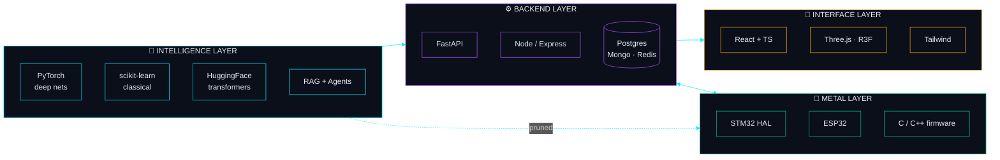
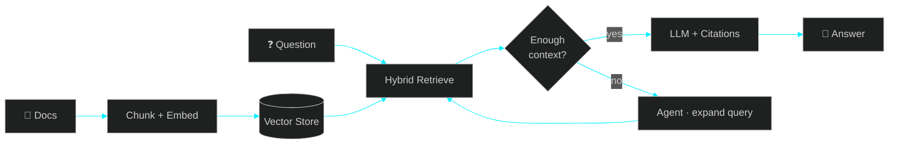
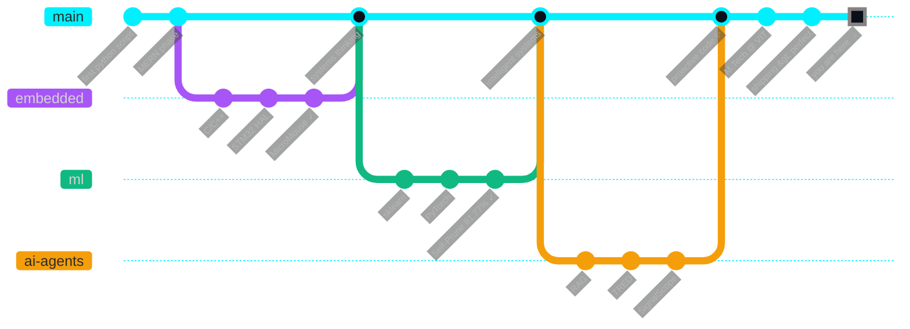

<!--
██████╗  █████╗ ██╗  ██╗███████╗██╗  ██╗██╗████████╗██╗  ██╗    ██████╗  █████╗      ██╗    ███████╗
██╔══██╗██╔══██╗██║ ██╔╝██╔════╝██║  ██║██║╚══██╔══╝██║  ██║    ██╔══██╗██╔══██╗     ██║    ██╔════╝
██████╔╝███████║█████╔╝ ███████╗███████║██║   ██║   ███████║    ██████╔╝███████║     ██║    ███████╗
██╔══██╗██╔══██║██╔═██╗ ╚════██║██╔══██║██║   ██║   ██╔══██║    ██╔══██╗██╔══██║██   ██║    ╚════██║
██║  ██║██║  ██║██║  ██╗███████║██║  ██║██║   ██║   ██║  ██║    ██║  ██║██║  ██║╚█████╔╝    ███████║
╚═╝  ╚═╝╚═╝  ╚═╝╚═╝  ╚═╝╚══════╝╚═╝  ╚═╝╚═╝   ╚═╝   ╚═╝  ╚═╝    ╚═╝  ╚═╝╚═╝  ╚═╝ ╚════╝     ╚══════╝
-->

<!-- ═══════════════════════════════════════════════ ANIMATED WAVE HEADER ═══════════════════════════════════════════════ -->

<a href="https://github.com/rakshithrajs">
  
</a>

<!-- ═══════════════════════════════════════════════ TYPING ANIMATION ═══════════════════════════════════════════════ -->

<div align="center">

<a href="https://github.com/rakshithrajs">
  
</a>

<br/><br/>

<!-- Quick Badges Row -->

<a href="https://linkedin.com/in/rakshithrajs"></a>
<a href="mailto:rakshithrajs@gmail.com"></a>
<a href="https://github.com/rakshithrajs"></a>


</div>

<br/>

<!-- ═══════════════════════════════════════════════ BOOT SEQUENCE ═══════════════════════════════════════════════ -->

## <samp>` ▶ 01  BOOT.SEQUENCE `</samp>

<table width="100%"><tr>
<td width="55%" valign="top">

```yaml
╭─ system ─────────────────────────────────╮
  user:      rakshith@vit-vellore
  program:   M.Tech · Software Engineering
  location:  Vellore, India  🇮🇳
  shell:     /bin/bash + uv + vscode
  runtime:   python ■ typescript ■ c/c++
╰──────────────────────────────────────────╯

╭─ focus ──────────────────────────────────╮
  ▸ RAG pipelines that reason, not retrieve
  ▸ Firmware for robots that decide
  ▸ Neural nets that fit on microcontrollers
  ▸ Three.js worlds that feel alive
╰──────────────────────────────────────────╯

╭─ mantra ─────────────────────────────────╮
  "Proactive agents beat reactive code."
╰──────────────────────────────────────────╯
```

</td>
<td width="45%" valign="top" align="center">


<br/>

<!-- Weather + Local time widget (live) -->
<a href="https://wttr.in/Vellore">
  
</a>

</td>
</tr></table>

<!-- animated divider -->


<br/>

<!-- ═══════════════════════════════════════════════ TECH STACK ═══════════════════════════════════════════════ -->

## <samp>` ▶ 02  ARSENAL.LOAD `</samp>

<div align="center">

<sub><i>hover any icon — they're live links to the docs</i></sub>

<br/><br/>

**`AI / ML`**

<a href="https://pytorch.org"></a>
<a href="https://scikit-learn.org"></a>
<a href="https://huggingface.co"></a>
<a href="https://numpy.org"></a>
<a href="https://opencv.org"></a>

**`BACKEND`**

<a href="https://fastapi.tiangolo.com"></a>
<a href="https://nodejs.org"></a>
<a href="https://expressjs.com"></a>
<a href="https://mongodb.com"></a>
<a href="https://postgresql.org"></a>
<a href="https://redis.io"></a>

**`FRONTEND`**

<a href="https://react.dev"></a>
<a href="https://typescriptlang.org"></a>
<a href="https://threejs.org"></a>
<a href="https://tailwindcss.com"></a>
<a href="https://vitejs.dev"></a>
<a href="https://www.framer.com/motion"></a>

**`SYSTEMS & EMBEDDED`**

<a href="https://isocpp.org"></a>
<a href="https://en.wikipedia.org/wiki/C_(programming_language)"></a>
<a href="https://rust-lang.org"></a>
<a href="https://go.dev"></a>
<a href="https://www.st.com/stm32"></a>
<a href="https://www.espressif.com"></a>
<a href="https://cmake.org"></a>

**`DEVOPS & TOOLS`**

<a href="https://git-scm.com"></a>
<a href="https://docker.com"></a>
<a href="https://linux.org"></a>
<a href="https://bash.org"></a>
<a href="https://code.visualstudio.com"></a>
<a href="https://github.com/astral-sh/uv"></a>

</div>

<br/>

<!-- Mermaid graph of the ecosystem -->

<details>
<summary><samp>&nbsp;&nbsp;🧬 <b>see how it all fits together</b> &nbsp;(click)&nbsp;</samp></summary>

<br/>



</details>

<br/>


<br/>

<!-- ═══════════════════════════════════════════════ PROJECTS ═══════════════════════════════════════════════ -->

## <samp>` ▶ 03  PROJECTS.DEPLOY `</samp>

<div align="center">
<sub>click any project to expand the full story, architecture, and stack</sub>
</div>

<br/>

<!-- === TRED === -->
<details>
<summary>

&nbsp;<b>RAG Intelligence Platform</b>
&nbsp;
</summary>

<br/>

> Turns a folder of documents into a colleague you can ask questions to.

**The problem:** Every company is sitting on terabytes of PDFs, wikis, and tickets that nobody reads.  
**The approach:** Ingest → embed → hybrid-search → LLM with citations → agent loop for follow-ups.  
**Why it's different:** Most RAG demos retrieve. This one *reasons* — it knows when to ask a follow-up, when to admit it doesn't know, and when to go fetch more context.



`FastAPI` · `React` · `TypeScript` · `Vector Store` · `LLM`

</details>

<!-- === SIGNALSCOPE === -->
<details>
<summary>

&nbsp;<b>News Intelligence Engine</b>
&nbsp;
</summary>

<br/>

> Reads the news so you don't have to — and tells you what's about to matter.

- **Ingest**: RSS + news APIs (thousands of articles/day)
- **Sentiment**: VADER lexicon for financial/political tone
- **Topics**: NMF decomposition → emerging topic clusters
- **Surface**: Dash + Plotly interactive dashboard

`Dash` · `Plotly` · `scikit-learn` · `NLTK` · `VADER` · `NMF`

</details>

<!-- === SELF-PRUNE === -->
<details>
<summary>

&nbsp;<b>Neural Network Pruning Research</b>
&nbsp;
</summary>

<br/>

> Made a neural net **81.77% smaller** without throwing it in a wood chipper.

| metric | before | after |
|---|---|---|
| **parameters** | 100% | **18.23%** |
| **accuracy (CIFAR-10)** | 57% | 54% |
| **inference (edge)** | 1x | **~4.8x faster** |
| **memory footprint** | 💾💾💾💾💾 | 💾 |

Why care? A pruned model runs on an ESP32. An un-pruned one doesn't.

`PyTorch` · `Iterative Magnitude Pruning` · `CIFAR-10`

</details>

<!-- === MICROMOUSE === -->
<details>
<summary>

&nbsp;<b>Autonomous Maze Solver</b>
&nbsp;
</summary>

<br/>

> A tiny C++ robot that walks into a maze it's never seen and walks out through the fastest path.

- Flood-fill + A* pathfinding
- Sensor fusion (IR + encoders)
- Desktop simulator with GUI for strategy replay
- From-scratch firmware, no framework

`C++` · `CMake` · `Embedded` · `Robotics` · `A*`

</details>

<!-- === LISECO === -->
<details>
<summary>

&nbsp;<b>Lightweight Secure Comms</b>
&nbsp;
</summary>

<br/>

> Crypto that runs on a microcontroller with 64 KB of RAM.

Cross-platform encryption layer for device↔device talk on STM32/ESP32. Python on one side, C on the other, same wire format. Designed for swarms, drones, and IoT meshes that can't trust the air.

`Python` · `C` · `Cryptography` · `ESP32` · `STM32`

</details>

<!-- === STM32 MOTOR === -->
<details>
<summary>

&nbsp;<b>Precision Motor Control</b>
&nbsp;
</summary>

<br/>

> Real-time PWM + feedback control stack for robotic actuators — built from HAL primitives, no Arduino layer.

`C` · `STM32 HAL` · `PWM` · `CMake` · `Real-time`

</details>

<!-- === VYADH === -->
<details>
<summary>

&nbsp;<b>3D Web Experience</b>
&nbsp;
</summary>

<br/>

> Because a regular website is boring. Three.js, GSAP, Framer Motion, particle fields — the works.

`React 19` · `Three.js` · `R3F` · `GSAP` · `Framer Motion` · `tsParticles` · `TailwindCSS 4`

</details>

<!-- === AUTOMATIONS === -->
<details>
<summary>

&nbsp;<b>Teams Bot · Email Inspector · ATS Matcher</b>
&nbsp;
</summary>

<br/>

| tool | what it does | stack |
|---|---|---|
| **Teams Automation** | UI-level Windows bot that runs Teams workflows while you sleep | `pywinauto` |
| **Email Inspector** | ML classifier that triages inbox chaos | `scikit-learn` · `NLP` |
| **ATS Matcher** | Scores resumes against job descriptions so real humans don't have to | `Python` · `NLP` · `TF-IDF` |

</details>

<br/>


<br/>

<!-- ═══════════════════════════════════════════════ GITHUB METRICS ═══════════════════════════════════════════════ -->

## <samp>` ▶ 04  METRICS.PROBE `</samp>

<div align="center">

<!-- Stats + streak side by side -->
<a href="https://github.com/rakshithrajs">
  
</a>
<a href="https://git.io/streak-stats">
  
</a>

<br/><br/>

<!-- Languages + activity -->
<a href="https://github.com/rakshithrajs">
  
</a>
<a href="https://github.com/rakshithrajs">
  
</a>

<br/><br/>

<!-- Trophies -->
<a href="https://github.com/ryo-ma/github-profile-trophy">
  
</a>

<br/><br/>

<!-- Activity graph -->
<a href="https://github.com/ashutosh00710/github-readme-activity-graph">
  
</a>

<br/><br/>

<!-- Snake eating contributions -->
<picture>
  <source media="(prefers-color-scheme: dark)" srcset="https://raw.githubusercontent.com/rakshithrajs/rakshithrajs/output/github-contribution-grid-snake-dark.svg"/>
  <source media="(prefers-color-scheme: light)" srcset="https://raw.githubusercontent.com/rakshithrajs/rakshithrajs/output/github-contribution-grid-snake.svg"/>
  
</picture>

<br/><br/>

<!-- 3D contributions -->
<a href="https://github.com/yoshi389111/github-profile-3d-contrib">
  
</a>

</div>

<br/>


<br/>

<!-- ═══════════════════════════════════════════════ JOURNEY TIMELINE ═══════════════════════════════════════════════ -->

## <samp>` ▶ 05  JOURNEY.TRACE `</samp>



<br/>

<!-- ═══════════════════════════════════════════════ NOW / CURRENTLY ═══════════════════════════════════════════════ -->

## <samp>` ▶ 06  RUNNING.NOW `</samp>

<table width="100%">
<tr>
<td width="33%" valign="top">

### 🔭 Building

- **TRED** — agentic RAG
- **SignalScope** — trend signals
- **LiSeCo** — secure meshes

</td>
<td width="33%" valign="top">

### 🧠 Learning

- Multi-agent orchestration
- Rust for embedded
- Diffusion-model internals

</td>
<td width="34%" valign="top">

### 🎯 Curious about

- Edge inference
- Formal verification
- Neuromorphic computing

</td>
</tr>
</table>

<br/>

<!-- Random quote widget -->

<div align="center">


</div>

<br/>


<br/>

<!-- ═══════════════════════════════════════════════ CONTACT ═══════════════════════════════════════════════ -->

## <samp>` ▶ 07  OPEN.CHANNEL `</samp>

<div align="center">

<sub>If you're building something in <b>AI systems</b>, <b>robotics</b>, or <b>edge ML</b> — I want to hear about it.</sub>

<br/><br/>

<table><tr>
<td align="center" width="180">
<a href="mailto:rakshithrajs@gmail.com">

<br/><sub><b>email</b></sub>
</a>
</td>
<td align="center" width="180">
<a href="https://linkedin.com/in/rakshithrajs">

<br/><sub><b>linkedin</b></sub>
</a>
</td>
<td align="center" width="180">
<a href="https://github.com/rakshithrajs">

<br/><sub><b>github</b></sub>
</a>
</td>
</tr></table>

</div>

<br/>

<!-- ═══════════════════════════════════════════════ FOOTER ═══════════════════════════════════════════════ -->

<div align="center">

```diff
+ Hand-coded every pixel
+ Real projects, real impact
+ Shipping > perfect
- Templates
- AI slop
- Hype without substance
```

</div>


<div align="center">
<sub><code>&lt;/&gt;</code>&nbsp; hand-coded &nbsp;·&nbsp; <code>⚡</code> no templates &nbsp;·&nbsp; <code>🔥</code> ship code &nbsp;·&nbsp; <code>🚀</code> make impact</sub>
</div>
